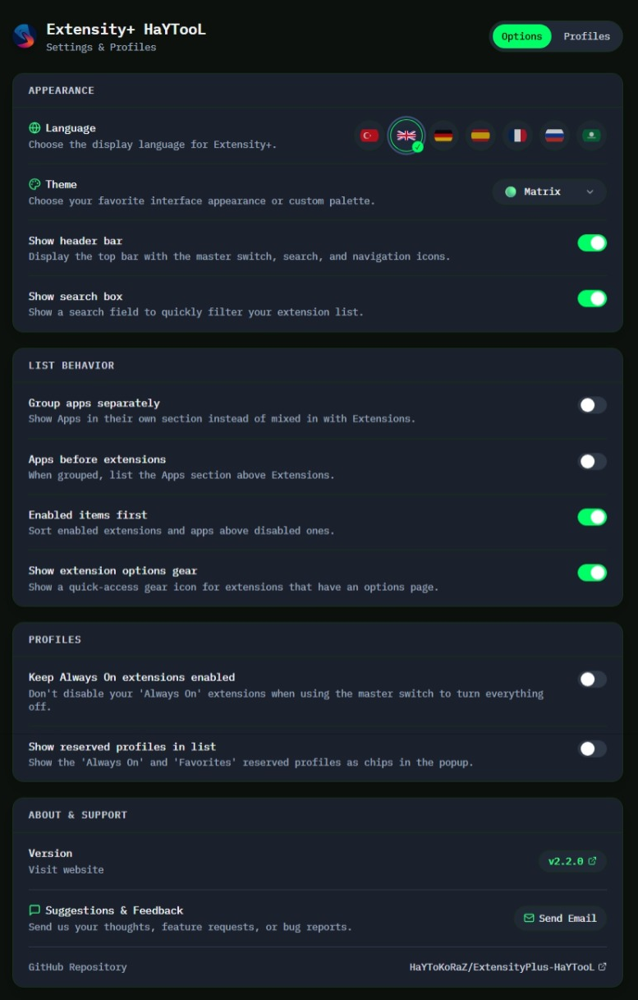
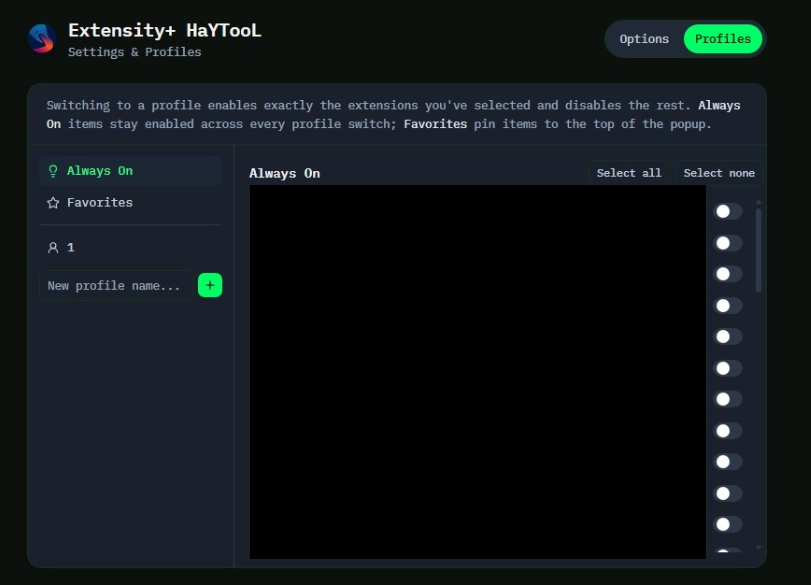

<p align="center">
  
</p>

# <p align="center">⚡ Extensity+ HaYTooL (v2.2.0)</p>

<p align="center">
  <b>The Ultimate Browser Extension Manager: Instant Toggling, Custom Profiles, Rich Themes & Multi-Language Support</b><br/>
  <i>Tarayıcı Uzantılarınızı Zahmetsizce Yönetin: Anında Aç/Kapat, Özel Profiller, Zengin Temalar ve Çoklu Dil Desteği</i>
</p>

<p align="center">
  <a href="#-english-version"><b>🇬🇧 English Version</b></a> | <a href="#-türkçe-versiyon"><b>🇹🇷 Türkçe Versiyon</b></a>
</p>

<p align="center">
  
  
  
  
  <br>
  
  
  
  
  
  <a href="https://github.com/HaYToKoRaZ/ExtensityPlus-HaYTooL/releases/latest"></a>
</p>

<p align="center">
  
  
  
  
</p>

---

<p align="center">
  <b>📸 Application Screenshots / Uygulama Ekran Görüntüleri</b>
</p>
<p align="center">
  
  
</p>

---
---

# 🇬🇧 English Version

## 🎯 Overview & Philosophy

Modern web development and daily browsing quickly lead to "extension bloat." Dozens of active extensions consume hundreds of megabytes of RAM, clutter your browser toolbar, and degrade page load performance.

**Extensity+ HaYTooL** is a modern, high-performance rewrite of the classic extension switcher. Rebuilt from the ground up using **React 18**, **TypeScript**, **Tailwind CSS**, and **Manifest V3**, it empowers you to instantly enable, disable, and organize extensions with zero lag and total privacy.

---

## 🚀 Key Features

* **⚡ One-Click Master Switch:** Instantly turn off all extensions when you need maximum speed or battery life, then restore them with a single click.
* **📂 Custom Work Profiles:** Group your extensions into custom contexts (e.g. *Dev Work*, *Shopping*, *Design*, *Media*). Activating a profile enables only the required tools and disables the rest.
* **🔒 "Always On" Protection:** Mark critical extensions (password managers, ad blockers) as *Always On* so they never get disabled by the master switch or profile changes.
* **⭐ Pinned Favorites:** Keep your most frequently used extensions pinned at the top of your popup for instant access.
* **🎨 Custom Themes & Aesthetics:**
  - 💻 **Match System:** Seamlessly follows your operating system's dark/light preference.
  - ☀️ **Light & 🌙 Dark:** Hand-crafted, balanced color palettes.
  - 🔴 **YouTube Theme:** True black background with signature red accents.
  - 🎮 **Discord Theme:** Deep indigo-slate palette with Discord blurple styling.
  - 🟢 **Matrix Theme:** Hacker-terminal black with phosphor green glow and monospace typography.
* **🌍 Multi-Language & Auto-Detection (7 Languages):**
  - Includes full native translations: 🇹🇷 Türkçe, 🇬🇧 English, 🇩🇪 Deutsch, 🇪🇸 Español, 🇫🇷 Français, 🇷🇺 Русский, 🇸🇦 العربية.
  - Automatically identifies your browser's language on first launch.
  - Quick language switching with clean, crisp SVG country flag badges.
* **🚀 Lightweight & Privacy First:** Zero external network calls, zero tracking/telemetry, and under 290 KB total bundle size.

---

## 🛠️ Installation & Setup

### Option 1: Direct Download from GitHub Releases (Recommended)
1. Go to the [Latest Releases](https://github.com/HaYToKoRaZ/ExtensityPlus-HaYTooL/releases/latest) page.
2. Download `ExtensityPlus-HaYTooL-v2.2.0-WebStore.zip` and unzip it.
3. Open your browser's extension page (`chrome://extensions` or `edge://extensions`).
4. Turn on **Developer Mode** (top-right toggle).
5. Click **Load unpacked** and select the unzipped folder.

### Option 2: Build from Source
```bash
# Clone the repository
git clone https://github.com/HaYToKoRaZ/ExtensityPlus-HaYTooL.git
cd ExtensityPlus-HaYTooL/ExtensityPlus-HaYTooL

# Install dependencies
npm install

# Build the project
npm run build
```
The compiled, production-ready extension will be inside the `dist/` directory.

---

## ⌨️ Keyboard Shortcuts & Quick Access
- Open the extension popup from anywhere using your browser's shortcut manager (`chrome://extensions/shortcuts`).
- Instant search filter: start typing immediately upon opening the popup.

---
---

# 🇹🇷 Türkçe Versiyon

## 🎯 Genel Bakış ve Felsefe

Günlük web gezintisi ve geliştirme süreçlerinde onlarca eklenti kurarız. Ancak açık kalan her eklenti yüksek miktarda RAM tüketir, tarayıcıyı hantallaştırır ve pil ömrünü kısaltır.

**Extensity+ HaYTooL**, efsanevi eklenti yöneticisinin modern web teknolojileriyle baştan yaratılmış, yüksek performanslı ve gizlilik odaklı sürümüdür. **React 18**, **TypeScript**, **Tailwind CSS** ve **Manifest V3** mimarisiyle yeniden inşa edilen bu araç, tarayıcınızın tam kontrolünü parmaklarınızın ucuna getirir.

---

## 🚀 Öne Çıkan Özellikler

* **⚡ Tek Tıkla Ana Şalter:** Performans veya oyun modu gerektiğinde tek tıkla tüm eklentileri kapatın, işiniz bittiğinde aynı tek tıkla eski haline döndürün.
* **📂 Akıllı Profiller:** Eklentilerinizi kullanım alanlarına göre gruplayın (*Yazılım*, *Alışveriş*, *Tasarım*, *Sosyal Medya*). Bir profile geçtiğinizde yalnızca o profildeki eklentiler açılır, diğerleri otomatik kapatılır.
* **🔒 "Daima Açık" Güvencesi:** Şifre yöneticisi veya reklam engelleyici gibi hayati eklentileri *Daima Açık* olarak işaretleyin; ana şalter kapansa bile bu eklentiler asla kapanmaz.
* **⭐ Favorileri Sabitle:** En çok kullandığınız uzantıları listenin en tepesine sabitleyerek anında erişin.
* **🎨 6 Farklı Tema Seçeneği:**
  - 💻 **Sistemle Eşle:** İşletim sisteminizin açık/koyu modunu otomatik takip eder.
  - ☀️ **Açık & 🌙 Koyu:** Gözü yormayan modern kontrast paletleri.
  - 🔴 **YouTube Teması:** Saf sinematik siyah arka plan ve YouTube kırmızı vurguları.
  - 🎮 **Discord Teması:** Koyu lacivert/gri tonlar ve resmi Discord moru (Blurple).
  - 🟢 **Matrix Teması:** Hacker terminali siyahı, fosforlu Matrix yeşili ve monospace yazı tipi.
* **🌍 7 Dil ve Otomatik Dil Algılama:**
  - Tam yerelleştirme desteği: 🇹🇷 Türkçe, 🇬🇧 English, 🇩🇪 Deutsch, 🇪🇸 Español, 🇫🇷 Français, 🇷🇺 Русский, 🇸🇦 العربية.
  - Tarayıcınız hangi dildeyse ilk açılışta otomatik olarak o dili seçer.
  - Vektörel gerçek SVG ülke bayrakları ile Ayarlar sayfasından anında dil değiştirilebilir.
* **🛡️ Sıfır Telemetri & %100 Gizlilik:** Dış sunuculara hiçbir veri göndermez, izleme kodu içermez ve ~288 KB ultra hafif boyuta sahiptir.

---

## 🛠️ Kurulum

### Yöntem 1: GitHub Releases Üzerinden (Hızlı Kurulum)
1. [En Son Sürümler (Releases)](https://github.com/HaYToKoRaZ/ExtensityPlus-HaYTooL/releases/latest) sayfasına gidin.
2. `ExtensityPlus-HaYTooL-v2.2.0-WebStore.zip` dosyasını indirin ve bir klasöre çıkartın.
3. Tarayıcınızda eklentiler sayfasına gidin (`chrome://extensions` veya `edge://extensions`).
4. Sağ üst köşedeki **Geliştirici Modu (Developer Mode)** anahtarını açın.
5. **Paketlenmemiş öge yükle (Load unpacked)** butonuna tıklayın ve çıkarttığınız klasörü seçin.

### Yöntem 2: Kaynak Koddan Derleme
```bash
git clone https://github.com/HaYToKoRaZ/ExtensityPlus-HaYTooL.git
cd ExtensityPlus-HaYTooL/ExtensityPlus-HaYTooL
npm install
npm run build
```
Derlenen eklenti `dist/` klasöründe hazır olacaktır.

---

## 📞 Destek ve İletişim

* **Web Sitesi:** [Extensity+ Tanıtım & Bilgi Sayfası](https://haytokoraz.github.io/ExtensityPlus-HaYTooL/)
* **E-posta:** `korazhayto@gmail.com`
* **GitHub:** [HaYToKoRaZ/ExtensityPlus-HaYTooL](https://github.com/HaYToKoRaZ/ExtensityPlus-HaYTooL)

*Geliştirici:* **HaYTo**
